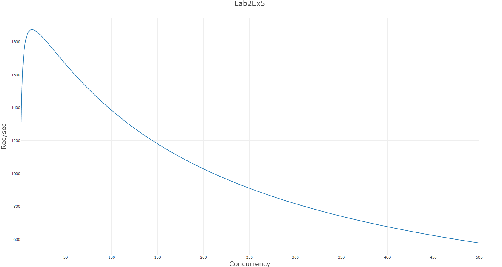
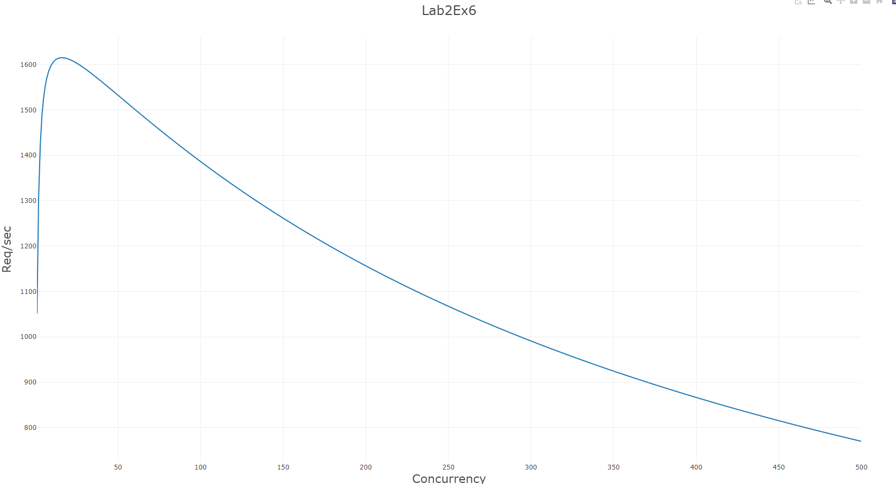

# wa2-g12-ticket-validation

Repository for the Lab 2 assignment of the Web Applications II course at Polytechnic University of Turin (academic year 2021-2022).

## Group 12 members:
| Student ID | Surname | Name |
| --- | --- | --- |
| s286154 | Ballario | Marco |
| s277873 | Galazzo | Francesco |
| s276086 | Tangredi | Giovanni |
| s292522 | Ubertini | Pietro |

## Usage

1. Move to the benchmark folder: ```cd benchmark```
2. Install loadtest: ```npm install -g loadtest```
3. Install jsonwebtoken: ```npm install jsonwebtoken```
4. Start the server
5. Run the benchmark clients benchmark1 or benchmark2:
   1. ```loadtest -p benchmark1.js -n [number-of-requests] -c [number-of-concurrent-clients] -T application/json http:://localhost:8080/validate```
   2. ```loadtest -p benchmark2.js -n [number-of-requests] -c [number-of-concurrent-clients] -T application/json http:://localhost:8080/validate```

benckmark1.js is used to verify for point 5 while benchmark2.js was used in point 6 and 7.

Windows users notes: the loadtest tool may be automatically installed in: ```C:\Users\[Username]\AppData\Roaming\npm\loadtest.cmd```

[Concurrency.kt](./server/src/main/kotlin/com/group12/server/Concurrency.kt)
can be used for generate the csv files in your local machine
## Graphs
All the csv and graphs can be found in the docs folder.
All the following measures where tested with clients and server in the same machine, if the clients and the server would run in different machines results will be more accurate, because in a single machine the cpu must switch betwwen clients threads and server thread and will use more resources.
Bear in mind that values depends on the machine running the server.
### Exercise 5 Stateless Validation


The graph above shows the points from the csv generated using the usl4j.

### Exercise 6 Stateful Validation


The graph above shows all the measures for exercise 6 , with the server now using a ConcurentHashMap for rejecting ticket already validated.
In general the Requests per seconds are slightly lower respect to the previous graph.


###  Exercise 7 Keep-Alive


The graph above rapresent the througthput with the keep above flag  set.
Since the connections are not closed at the end of the HTTP requests the Requests per second are much higher than in the previous graphs because the clients do not nedd to open new connection but can continue to use the same ones.

###  Exercise 7 Time limit


For this graph the time limit value was set to 2 seconds.
Since the time is to low not all the request will be completed before the connections are shut down.
so the requests per seconds are much lower.


For this graph the time limit value was set to 30 seconds.
This time the time is enough for complete all the requests so the throughput is similar to the one for the Exercise 6 